# ALife Simulation Suite

A collection of four core experiments exploring artificial-life and computational dynamics:

1. **Reaction–Diffusion CA** (`rd.py`)  
2. **GPU-Accelerated Physics Simulation** (`physics/__main__.py` + `diffusion.cl`)  
3. **GoLEM: Game Of Life with Energy-Mass equivalence** (`golem.py`)  
4. **NEAT Coevolution (Grass & Prey)** (`evo/__main__.py`)

---

## Methodology

### Reaction–Diffusion Chemistry with Virtual Cells & GRNs

Building on agent-based models of cancer and immune dynamics (e.g. the Krishnaswamy Lab’s EuclideanSimulation), this experiment abstracts away biochemical and cell-type specifics to focus on fundamental life principles. The two-dimensional grid carries seven continuous species—water, CO₂, O₂, sugar, ATP, protein, and a generic mitogen—that diffuse per Fick’s law and react via a unified reaction list with both background and cell-catalyzed rates.  

Each cell occupies one grid site and maintains **three functional channels** for every chemical:  
1. **Reaction channel** (enzymes): positive values catalyze production reactions; negative values catalyze consumption.  
2. **Transport channel** (transporters): controls active import or export against gradients.  
3. **Motor channel** (motors): dictates energy-driven movement toward or away from chemical cues.  

Channels are driven by a small, evolvable neural network that takes environmental concentrations and a cell’s current channels as inputs and outputs channel update values at an ATP cost—abstracting gene-to-protein translation and receptor dynamics into a unified, energy-conscious decision process. When mitogen and resource thresholds are met, cells divide—splitting chemical resources and mutating network weights—while ATP depletion or lifespan limits trigger death and release of internal contents back into the field.  

This minimal yet biologically inspired framework emphasizes **metabolism**, **chemotaxis**, **transport**, and **division** as the core capabilities of life, enabling emergent gradient formation, differentiation-like cycles, and synthetic-biology behaviors without hard-coding specialized cell types.  

### GPU-Accelerated Physics Simulation
This experiment takes inspiration from the Biomaker CA framework ([Randazzo et al.](https://google-research.github.io/self-organising-systems/2023/biomaker-ca/)), which simulates a richly typed biome via simple, local cellular-automaton rules. Rather than hard-coding several cell types like they do (stem, leaf, root, seed, air, dirt, etc.), we abstract every material down to its **intermolecular force** characteristics. Each pixel's RGBA color represents a four-channel “phase” vector (solid, gas, liquid, void), and we assign each phase a **solidity** parameter that proxies bond strength—strong ionic/covalent bonds for solids, hydrogen bonds for liquids, and weak London forces for gases.

At each time step, an OpenCL kernel runs over the grid and applies two core local exchanges:

1. **Gravity-like exchange** with the pixel above/below, clamped by the neighbor’s solidity. This captures how denser or more strongly bonded materials resist buoyant motion.  
2. **Diffusive exchange** with the four orthogonal neighbors, scaled by the inverse of solidity. This encodes how weakly bonded phases (e.g. air) spread rapidly, while strongly bonded phases (e.g. stone) remain localized.

By tuning solidity values (e.g. 0.999 for rock, 0.5 for water, 0.001 for air), we can observe how the system self-organizes into lifelike material interactions—liquids pool, solids pile, and something like bubbles form when low-solidity “air” rises through the higher-solidity “water” matrix. A NumPy reference implementation on the CPU highlights the dramatic throughput advantage of GPU compute.  

This experiment unifies falling-sand dynamics and fluid behavior, which could be useful in future artificial-life models that integrate material physics with metabolism, chemotaxis, and multicellular mechanics.

### GoLEM: Game Of Life with Energy–Mass equivalence  
This experiment reimagines Conway’s Game of Life as a miniature physics sandbox governed by conservation laws and entropy. Inspired by Einstein’s $E=mc^2$, we treat mass and energy as interconvertible yet globally conserved quantities: a cell birth consumes one unit of energy, and a cell death releases that energy back into the field. In the absence of life, the system tends toward “entropy”–increasing equilibrium under standard Life rules.  

To capture how living patterns locally decrease entropy, each cell carries both mass and energy stores and participates in a learned, decentralized energy‐routing process. We augment the binary GoL grid with a continuous energy channel plus a set of hidden “genome” channels. A neural‐policy CA—analogous to [Growing Neural Cellular Automata](https://distill.pub/2020/growing-ca/)—reads local mass, energy, and hidden channels, then directs energy flows across each 3×3 neighborhood, conserving the total and modeling how organisms “hijack” physics to persist ordered patterns. Cells inherit their parents' crossed-over policy parameters upon reproduction and lose them at death, enabling evolutionary adaptation of energy‐management strategies.  

By fusing Life’s simple birth/death topology with energy–mass conversion, entropy considerations, and an evolvable neural CA policy, GoLEM aims to exhibit richer emergent phenomena—sustained oscillators, self-organized energy waves, and resource-driven pattern formation—that mirror how real organisms defy equilibrium to survive and replicate under thermodynamic constraints.  

### NEAT Coevolution of Grass and Prey

In this experiment, we simulate an abstract ecosystem of autotrophic “grass” and herbivorous “prey” on a toroidal grid, with both species’ behaviors governed by evolvable neural controllers optimized via the NEAT algorithm. Each organism carries a genome that encodes a Compositional Pattern-Producing Network (CPPN), which in turn generates a phenotype neural network mapping local sensory inputs to action outputs.

- **Sensory Inputs:**  
  - Grass senses a **3×3** RGB patch of its immediate neighborhood to decide where to propagate or expend energy.  
  - Prey senses a larger **9×9** RGB field, enabling more sophisticated foraging and avoidance strategies over a wider area.

- **Actions:**  
  - **Movement:** networks output Δx, Δy vectors; prey use theirs to move toward nutrients or away from threats, consuming energy proportional to distance moved.  
  - **Asexual Reproduction:** when energy exceeds a threshold, an organism can clone itself into an adjacent empty cell.  
  - **Sexual Reproduction (Prey only):** if two prey mutually point at each other (each network’s Δx, Δy directs toward the other’s location) and both have sufficient energy, they produce a shared offspring in a neighboring empty site, combining and mutating both genomes.

- **Energy Dynamics:**  
  - Grass regenerates energy passively over time and must maintain a minimum to reproduce.  
  - Prey gain energy by consuming grass when moving into a grass-occupied cell, and lose energy via movement and reproduction. Death occurs if energy falls to zero.

By coevolving these simple sensory-motor networks, grasses adapt growth patterns that reduce predation risk, while prey evolve foraging tactics—clustering, dispersal, ambush—and even mutual breeding behaviors. Over thousands of generations, this setup yields rich ecological dynamics: spatial patchiness in grass, prey herding and avoidance, and arms-race feedback loops, illustrating how minimal neural controllers under selection can generate complex, lifelike interactions.  

---

## 📂 Directory Structure

```
.
├── evo/                         # NEAT-based coevolution experiments
│   ├── nn/                      # neural network modules
│   │   ├── ffnn.py 
│   │   ├── graphs.py            # network visualization and graph functions
│   │   ├── phenotype_nn.py
│   │   └── rnn.py
│   ├── genome.py                # genome and evolutionary operators
│   ├── functions.py             # activation functions
│   ├── evolve.py                # Population class
│   ├── game1.py                 # grass–herbivore sim
│   └── config.py                # NEAT hyperparameters
│
├── physics/                     # GPU physics simulation
│   ├── diffusion.cl             # OpenCL kernel
│   ├── gump.jpg                 # input image
│   └── game3.py                 # host code (PyOpenCL)
│
├── rd.py                        # Reaction–Diffusion CA
├── golem.py                     # GoLEM: Game Of Life Energy-Mass
│
├── assemble_videos.sh           # Bash script to assemble MP4s
├── plot_metrics.py              # Python script to generate plots
├── out/                         # Auto-generated outputs
│   ├── rd/
│   │   ├── frames/
│   │   └── metrics.csv
│   ├── physics/
│   │   ├── frames/
│   │   ├── gpu_times.csv
│   │   └── cpu_times.csv
│   ├── golem/
│   │   ├── frames/
│   │   └── stats.csv
│   ├── evo/
│   │   ├── frames/
│   │   └── metrics.csv
│   ├── plots/
│   │   ├── reaction_diffusion_means.png
│   │   ├── physics_timing.png
│   │   ├── golem_summary.png
│   │   └── evo_population.png
│   └── videos/                  # MP4s assembled by `assemble_videos.sh`
│       ├── rd.mp4
│       ├── physics.mp4
│       ├── golem.mp4
│       └── evo.mp4
├── Pipfile                      # project dependencies
├── Pipfile.lock
└── README.md                    # ← you are here
```

---

## ⚙️ Installation

1. **Clone** this repository  
   ```bash
   git clone https://github.com/jpsank/thesis.git
   ```
2. **Install dependencies**  
   ```bash
   pipenv install
   pipenv shell
   ```
   or
   ```bash
   conda create -n alife python=3.11
   conda activate alife
   conda install -c conda-forge \
     numpy matplotlib pandas pyopencl torch \
     jax jaxlib networkx pygame imageio pygraphviz
   ```

3. **Ensure** you have an OpenCL driver for your GPU (for GPU physics simulation)

---

## 🚀 Running Experiments

Activate your virtualenv and then run each script as follows:

### 1. Reaction–Diffusion CA  
```bash
python rd.py \
  --width 100 \
  --height 100 \
  --dt 0.1 \
  --steps 5000 \
  --vis-interval 10 \
  --output-dir out/rd
```

### 2. GPU-Accelerated Physics Simulation  
```bash
python -m physics \
  --input-image physics/gump.jpg \
  --width 576 \
  --height 384 \
  --steps 500 \
  --compare-cpu \
  --output-dir out/physics \
  --display
```

### 3. GoLEM — Game Of Life Energy-Mass  
```bash
python golem.py \
  --size 150 \
  --steps 1000 \
  --output-dir out/golem
```

### 4. NEAT Coevolution (Grass & Prey)  
```bash
python -m evo \
  --steps 5000 \
  --save-interval 10 \
  --output-dir out/evo
```

---

### 📈 Results & Visualization

1. **Assemble Videos**  
   ```bash
   ./assemble_videos.sh
   ```
   Generates:
   ```
   out/videos/rd.mp4
   out/videos/physics.mp4
   out/videos/golem.mp4
   out/videos/evo.mp4
   ```

2. **Generate Plots**  
   ```bash
   python plot_metrics.py
   ```
   Saves figures to `out/plots/`.

3. **Direct Inspection**  
   - **Frames:** `out/<experiment>/frames/*.png`  
   - **Metrics CSV:** inspect with Pandas or Excel  
   - **Plots:** `out/plots/*.png`

---

## 📊 Results

### 1. Reaction–Diffusion Chemistry with Virtual Cells & GRNs

**Environmental Metrics**  

| Timestep | H₂O    | CO₂    | O₂     | Sugar   | ATP      | Protein  | Mitogen  |
|---------:|:-------|:-------|:-------|:--------|:---------|:---------|:---------|
| 0        | 1.00000| 1.00000| 1.00000| 1.00006 | 1.99998  | 0.000001 | 0.06094  |
| 2999     | 0.98448| 0.98409| 0.98109| 0.98825 | 1.82319  | 0.02165  | 0.00383  |

**Population Metrics (at _T_ = 2999)**  
- **Live‐cell count:** 2  
- **Mean Internal ATP:** 0.9116

**Qualitative observations:**  
1. **Rapid mitogen‐driven expansion:** Cells adjacent to the central mitogen patch divide explosively, creating an outward-moving front early in the run (Figure 1a at _t_ = 50).  
2. **Trail-forming motility and tandem movement:** Around _t_ ≈ 860, motile cells leave detectable chemical trails and occasionally move in coordinated pairs (Figure 1b), reflecting emergent chemotactic following behavior.  
3. **Long-term survivors:** By _t_ = 3000, two cells remain alive (Figure 1c), suggesting evolved strategies for exploiting residual gradients or minimizing energy expenditure under resource scarcity.

| 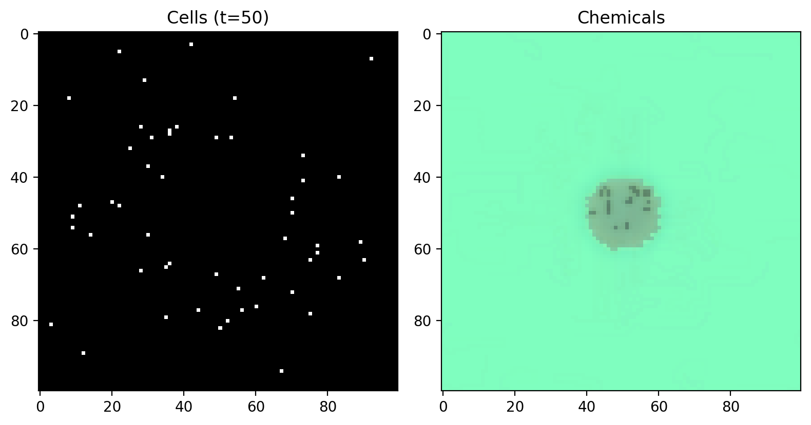 | 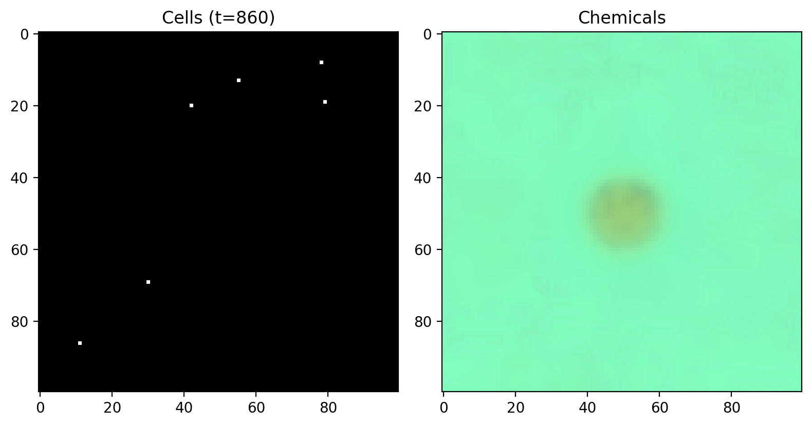 | 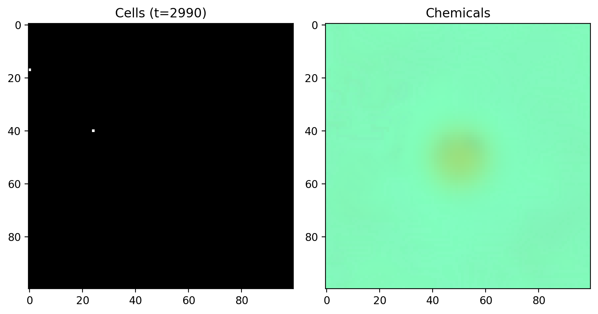 |
|:-----------------------------------------:|:-----------------------------------------:|:------------------------------------------:|
| **Figure 1a:** Early growth (_t_ = 50)    | **Figure 1b:** Tandem motility (_t_ = 860) | **Figure 1c:** Survivors (_t_ = 2990)   |

| 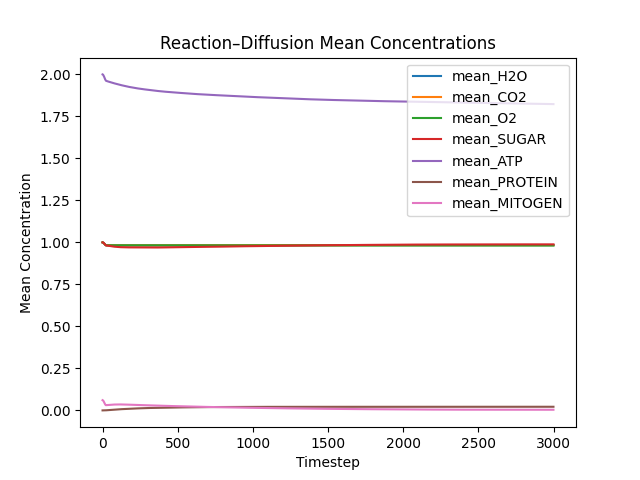 |
|:---------------------------------------:|
| **Figure 1d:** Mean chemical concentrations over time |

|  |
|:---------------------------------------:|
| **Figure 1e:** Video of the RD simulation over time |

**Discussion of RD Results (see “Discussion” below):**  
- The slight decrease in H₂O, CO₂, and O₂ and the drop in mitogen reflect consumption by cell-mediated reactions, while ATP remains elevated from accumulated metabolic output.  
- Emergent motility behavior confirms that simple transporter and motor channels, driven by neural network outputs, suffice to produce chemotactic-like dynamics without explicit movement rules.  
- The persistence of two cells highlights the need for dynamic resource inputs—future work could introduce periodic mitogen or sugar influx to sustain a stable population.

---

### 2. GPU-Accelerated Physics Simulation

**Performance Metrics**  
| Metric                  | Value      |
|-------------------------|------------|
| Avg. GPU time/step      | 1.36 ms    |
| Avg. CPU time/step      | 74.51 ms   |
| GPU → CPU Speedup       | ×54.8      |

**Qualitative Observations:**  
1. **Bubble-like air pockets:** Pockets of the low-solidity “air” phase (with higher values of green color) spontaneously coalesce and rise through the higher-solidity solid (red) and “water” phase (blue), forming discrete collections of bubbles that ascend and escape at the top—reminiscent of lava-lamp dynamics (Figure 2a).  
2. **Persistent liquid trapping:** The high-solidity “solid” phase (red) clumps together so strongly that water and even gass trapped beneath remains confined, producing under-solid fluid pockets (Figure 2b).  
3. **Layered material interactions:** Over time, we observe layering where solids settle, liquids pool, and gases dissipate—demonstrating realistic phase separation and buoyancy effects driven by our simple solidity-based exchange rules (Figure 2c).

| 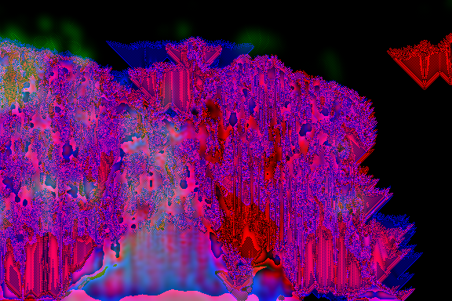 | 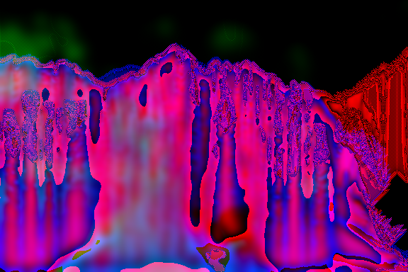 | 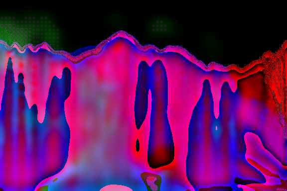 |
|:---------------------------------------:|:---------------------------------------:|:---------------------------------------:|
| **Figure 2a:** Bubble nucleation & rise (_t_ = 100) | **Figure 2b:** Subsurface bubbles & trapping (_t_ = 250) | **Figure 2c:** Surface clearance & layering (_t_ = 400) |

| 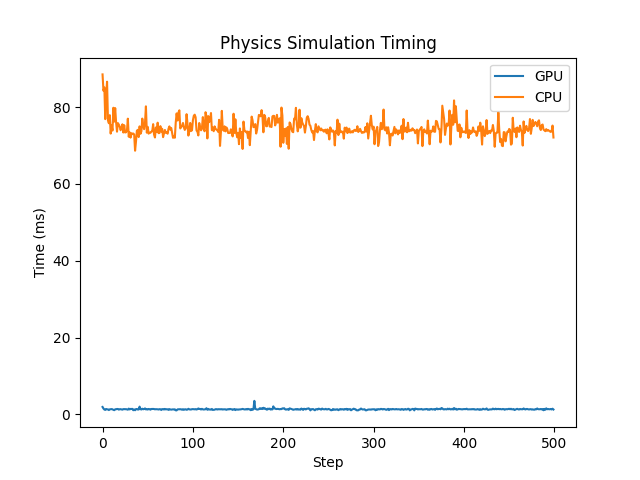 |
|:---------------------------------------:|
| **Figure 2d:** Per-step timing comparison for GPU vs. CPU implementations |

|  |
|:---------------------------------------:|
| **Figure 2e:** Video of the physics simulation over time |

**Discussion of Physics Results (see “Discussion” below):**  
- Although the visual output deviates from exact fluid dynamics, our diffusion and gravity formulas capture key lifelike behaviors—especially bubble formation, buoyant rise, and phase separation.  
- Color-coding (blue = liquid, green = gas, red = solid) highlights these interactions vividly.  
- GPU acceleration is critical: a ~55× speedup over the CPU baseline enables real-time exploration of material self-organization at scale.

---

### 3. GoLEM: Game Of Life with Energy–Mass Dynamics

**Equilibrium Metrics**  
Initial transient gives way to a stable regime after a few dozen steps, when most mobile structures have died out.

| Timestep | Total Mass | Total Energy | Conserved Sum | Live Cells |
|---------:|-----------:|-------------:|--------------:|-----------:|
| 1        | 3201.0     | 1349.0       | 4550.0        | 3201       |
| 10       | 2485.0     | 2065.0       | 4549.9        | 2485       |
| 60       | 2466.0     | 2084.0       | 4550.0        | 2466       |
| 100      | 2466.0     | 2084.0       | 4550.0        | 2466       |

**Key Observations:**  
1. **Glider‐like oscillators:** Shortly after random initialization, mobile glider‐like structures emerge (e.g., around _t_ = 10) that traverse the grid under combined Life and energy rules (Figure 3b).  
2. **Transition to still‐life equilibrium:** By _t_ ≈ 60, most gliders have burned out, leaving only small oscillators and novel still‐life configurations that are sustained by the introduced energy constraints—these stills do not appear in classical GoL (Figure 3c).  
3. **Conserved dynamics:** After _t_ = 60, total mass and energy fluctuate minimally around their conserved sum (~4550), and live‐cell count remains constant, indicating a true non‐trivial equilibrium enforced by energy‐mass routing.

| 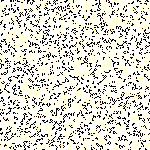 | 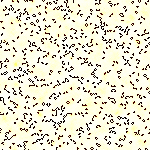 | 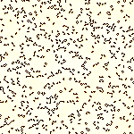 |
|:-------------------------------------:|:-------------------------------------:|:--------------------------------------:|
| **Figure 3a:** Random initialization (_t_ = 0)  | **Figure 3b:** Glider‐like dynamics (_t_ = 10) | **Figure 3c:** Still‐life equilibrium (_t_ = 60) |

| 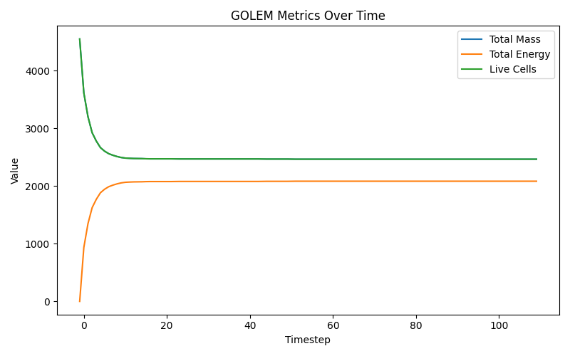 |
|:---------------------------------------:|
| **Figure 3d:** Total mass, energy, and live cells over time (note 1 mass = 1 live cell) |

|  |
|:---------------------------------------:|
| **Figure 3e:** Video of the GoLEM simulation over time |

**Discussion of GoLEM Results (see “Discussion” below):**  
- Energy constraints transform classic GoL dynamics, suppressing unbounded glider proliferation and enabling novel still‐lifes not seen in the original automaton.  
- The persistent still‐life patterns underscore how mass–energy conservation and routing policies can stabilize structures that would otherwise not survive.  
- This equilibrium regime suggests potential for studying energy‐based pattern resilience and controlled perturbations to generate complex behaviors.

> *Note:* A subtle yellow tint on dead (formerly white) cells and a red tint on live (formerly black) cells indicate higher energy levels.  

---

### 4. NEAT Coevolution of Grass and Prey

**Population Metrics**  
| Timestep | Grass Population | Prey Population |
|---------:|-----------------:|----------------:|
| 0        | 20               | 100             |
| 800      | 737              | 152             |
| 2000     | 412              | 215             |
| 2325     | 150              |   0             |
| 4999     | 180              |   0             |

**Qualitative Observations:**  
1. **Directional grass expansion (Figure 4a, _t_ = 200):** Grass genomes evolve to favor reproduction in specific directions, yielding elongated patches rather than uniform spread.  
2. **Prey congregation and infiltration (Figure 4b, _t_ = 900):** As grass patches mature, prey cluster at their edges, then evolve to penetrate into grass areas to feed directly on interior cells.  
3. **Aggressive infestation (Figure 4c, _t_ = 1500):** Upon eating, prey proliferate in all directions from grazing sites, creating dense infestations that overrun grass clusters.  
4. **Prey extinction (Figure 4d, _t_ = 2300):** Unchecked reproduction depletes grass resources, causing prey to exhaust their energy budgets and drive themselves extinct; only grass remains thereafter.

| 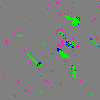 | 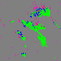 | 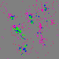 | 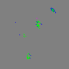 |
|:-----------------------------------:|:-----------------------------------:|:-----------------------------------:|:-----------------------------------:|
| **Figure 4a:** Directional grass patches (_t_ = 200) | **Figure 4b:** Prey infiltration (_t_ = 900) | **Figure 4c:** Infestation outbreak (_t_ = 1540) | **Figure 4d:** Only one prey left, soon to die (_t_ = 2300) |

| 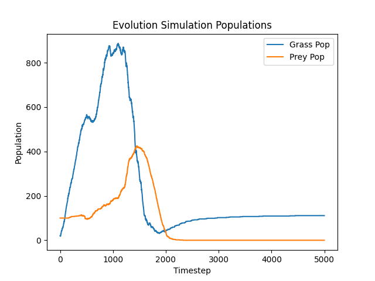 |
|:-----------------------------------:|
| **Figure 4e:** Grass and prey populations over time |

|  |
|:-----------------------------------:|
| **Figure 4f:** Video of the NEAT coevolution simulation over time |

**Discussion of NEAT Evo Results (see “Discussion” below):**  
- Grass learns anisotropic spreading patterns, which prey exploit by clustering and penetrating clusters.  
- Prey’s aggressive reproduction without negative feedback leads to resource exhaustion and self-extinction.  
- Introducing evolutionary constraints—such as energy costs for reproduction beyond simple thresholds, or negative density-dependent effects—could stabilize long-term coexistence.

---

## Discussion

Across these four experiments, we observe how simple local rules, when combined with conserved quantities and evolvable control, give rise to rich, lifelike behaviors:

1. **Emergence through Conservation Laws**  
   - In both the Reaction–Diffusion Chemistry and GoLEM experiments, enforcing conservation of mass and energy introduces nontrivial steady states.  
   - The Chem RD model collapses without sustained inputs, whereas GoLEM’s routing policy stabilizes populations into persistent still‐lifes, illustrating how active resource management alters CA dynamics.

2. **Chemotactic and Motility Behaviors**  
   - Cells in the Chem RD model exhibit trail‐following and tandem movements purely through transporter and motor channels driven by GRN outputs—no explicit movement code was needed.  
   - In GoLEM, glider‐like oscillators metamorphose into novel energy‐bounded stills, indicating that neural routing of conserved resources can stabilize or extinguish classical CA motifs.

3. **Phase Separation and Material Self‐Organization**  
   - The GPU physics CA, inspired by Biomaker CA, demonstrates how a single “solidity” parameter per phase yields realistic layering, bubble nucleation, and buoyant rise.  
   - A ~55× GPU speedup over CPU makes real‐time exploration feasible, highlighting the importance of hardware acceleration for large-scale artificial‐life simulations.

4. **Coevolutionary Dynamics and Failure Modes**  
   - Grass and prey coevolution under NEAT pressures yields sequential strategies—directional expansion, prey infiltration, infestation—mirroring ecological arms races.  
   - The prey‑driven extinction event underscores the need for regulatory feedback (e.g., resource signaling, density‐dependent costs) to sustain long‐term coexistence.

5. **Interplay of Biology and Abstraction**  
   - Abstracting biological processes (e.g., metabolism, transport, division) into minimal channels and networks allows focus on fundamental principles—conservation, diffusion, evolution—without overfitting to specific biological systems.  
   - Yet, each model remains extensible: we can add new reactions, feedback loops, or physical forces to probe further into the origins of life‐like phenomena.

Overall, these experiments chart a spectrum from purely chemical pattern‐formation to agent‐based coevolution, unified by core ideas of resource conservation, local decision‐making, and emergent organization. They demonstrate that even vastly simplified proxies for metabolism, physics, and evolution can produce behaviors reminiscent of real life, laying groundwork for future artificial‐life frameworks that integrate chemistry, mechanics, and adaptive control.

---

## Conclusions

This thesis explored four distinct yet thematically linked experiments that demonstrate how simple local rules, conserved resources, and evolvable control can give rise to rich, lifelike phenomena:

1. **Reaction–Diffusion Chemistry with Virtual Cells & GRNs** showed that embedding cells with minimal internal chemistry and gene regulatory networks into a reaction–diffusion medium yields emergent motility, chemotactic trails, and resource‐limited population dynamics. While the system collapsed without sustained nutrient inputs, it evidenced genuine gradient‐driven behavior and hinted at strategies for indefinite persistence.

2. **GPU-Accelerated Physics Simulation** distilled material interactions to a single “solidity” proxy per phase and two local exchange laws, reproducing bubble formation, buoyant rise, and phase separation. A ∼55× GPU speedup over CPU illustrates the power of data-parallel compute for scaling artificial-life environments.

3. **GoLEM: Game of Life with Energy–Mass Dynamics** reinterpreted Conway’s CA through the lens of energy-mass equivalence and conservation. By coupling birth/death rules with an evolved neural routing policy, GoLEM transitions from transient glider oscillations to novel still‐life equilibria, revealing how resource constraints stabilize patterns beyond classical GoL.

4. **NEAT Coevolution of Grass & Prey** implemented a minimalist ecosystem in which grasses and herbivores coevolve sensory-motor networks under NEAT. The run of sequential strategic phases—directional grass patches, prey infiltration, infestation, and eventual prey extinction—highlights both the creative potential and pitfalls of open-ended evolution without regulatory feedback.

Taken together, these studies underscore that even highly abstracted models—whether chemical, physical, or ecological—can reproduce core aspects of living systems: metabolism, movement, growth, adaptation, and self-organization. Conserved quantities (mass, energy) and simple control architectures (GRNs, neural policies, NEAT-evolved networks) provide a unifying framework for artificial-life research. The work lays a foundation for future investigations into sustained self-organization, multi-scale coupling of chemistry and mechanics, and evolvable life-like systems that bridge the gap between minimal models and biological complexity.  

---

## Future Work

Building on these four experiments, several avenues can deepen our understanding of artificial-life systems and push the models closer to biological realism:

1. **Dynamic Resource Influx & Homeostasis**  
   - Introduce periodic or spatially distributed nutrient and mitogen sources in the Reaction–Diffusion Chemistry model to sustain populations and study steady‐state diversity.  
   - Implement feedback‐regulated background reactions (e.g., photosynthetic sugar synthesis) to model external energy inputs.

2. **Parameter Sweeps and Phase Diagrams**  
   - Systematically vary key parameters (diffusion rates, reaction cost coefficients, energy leak rates, solidity values) to map emergent behavior regimes (e.g., pattern formation, oscillatory phases, extinction thresholds).  
   - Employ automated grid searches and sensitivity analysis to identify bifurcation points and critical transitions in each model.

3. **Enhanced GRN Architectures**  
   - Expand the gene regulatory network model with additional channel types (e.g., signaling peptides, receptor analogs) to explore richer cell–cell communication and differentiation protocols.  
   - Compare discrete logical GRNs versus continuous neural‐net proxies to assess trade-offs in evolvability and behavioral complexity.

4. **3D Extension and Multiscale Coupling**  
   - Generalize the Reaction–Diffusion and Physics CAs to three dimensions, coupling volumetric diffusion with 3D cell populations or fluid–solid interactions.  
   - Integrate biomechanical forces (e.g., adhesion, pressure) with chemical and energetic dynamics to model tissue‐like growth and morphogenesis.

5. **Stabilizing Coevolutionary Feedbacks**  
   - In the NEAT ecosystem, introduce negative feedback mechanisms (e.g., resource signaling, disease spread, density‐dependent reproduction costs) to prevent runaway extinction and achieve long‐term coexistence.  
   - Investigate tournament and island‐model coevolution setups to foster spatially heterogeneous evolutionary dynamics.

6. **Benchmarking & Real‐Time Interaction**  
   - Package the GPU‐Accelerated Physics simulation as an interactive tool (e.g., with UI sliders for solidity or diffusion) to explore material behaviors in real time.  
   - Profile and optimize neural routing CA implementations for deployment on WebGL or mobile GPUs, enabling broader accessibility.

7. **Integration into a Unified Artificial‐Life Framework**  
   - Develop a modular platform where chemical, physical, and ecological CAs can be composed—e.g., embedding motile cells from the Chem RD model into GOLEM or coupling grass–prey agents with underlying fluid flows.  
   - Leverage standardized interfaces (e.g., JSON or YAML configs) to orchestrate hybrid simulations and facilitate reproducible research.

By pursuing these directions, we can progressively bridge minimal artificial-life models and more comprehensive in silico ecosystems, offering insights into the fundamental principles that underlie living systems and their emergence from simple rules.  

---

## 📖 Citation

If you use this code or the experiments in your work, please cite:

> Julian Sanker, “GPU-Accelerated Agent-Based Simulation for Cell Dynamics,” Senior Thesis, Yale University, 2025.

---

## 📝 License

This project is released under the MIT License. See [LICENSE](LICENSE) for details.
